# Canvas

# 一 概述

canvas是html5的一个新标签，相当于一个画布，可以用来绘制丰富的图形，最终渲染在浏览器上。

但canvas标签本身不具备绘制图形的能力，配合javascript提供的CanvasAPI，才能绘制图形，文本和图像，以及实现动画和交互

支持2d绘图，也支持3d绘图（webgl）

canvas绘制的图形是一个位图

* 放缩会导致图像失真，所以需要注意放缩比例的控制
* 可以操作每一个点位的像素，进而实现高度自定义的图形绘制和动画效果
* 相当于img引入的图片，可以右键另存

canvas绘制的内容不属于dom元素，通常比dom元素绘制的方式有更高的渲染能力

但也存在一些问题，比如无法在浏览器查看器中查找，也无法支持鼠标监听（但可以通过其他方式实现类似的效果）

canvas应用领域：

* 可视化图表
* h5游戏制作
* banner广告

# 二 画布与画笔

## 1 创建画布和画笔

提供一个 `<canvas>`标签(html)

有一个canvas对象(js-画布)

有一个context对象(js-画笔)

* CanvasRenderingContext2D

```html
 <canvas id="c1"></canvas>

<script>
    const convas1 = document.querySelector('#c1');
    const context1 = canvas1.getContext('2d');
</script>
```

> 有2种提供canvas标签的方式

方式一：直接定义canvas标签

方式二：利用js创建canvas标签 （推荐，vscode有更友好的提示）

* 使用js方式创建canvas时，canvas对象 和 context对象都是具体的类型(HTMLCavansElement , CanvasRenderingContext2D)，vscode编码开发时， 提示更加友好。

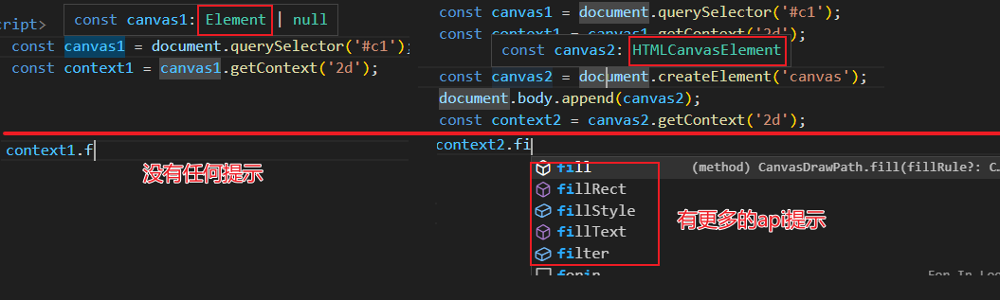

> canvas标签的版本检查

绝大多数的浏览器都支持canvas。但少数老版本的浏览器支持不佳（IE9-）

* 使用文本/图片替换canvas : 浏览器不支持canvas，会显示标签中的文本或图片内容。
* 脚本检测  : 浏览器不支持canvas，则canvas对象没有getContext函数

```html
<canvas id="c1">
    您的浏览器版本过低，不支持canvas，请升级浏览器或更换浏览器
</canvas>
```

```javascript
 if(!canvas2.getContext){
     console.log('您的浏览器版本过低，不支持canvas，请升级浏览器或更换浏览器');
 }else{
     // codeing...
 }
```

## 2 画布区域特点

canvas是一个行内元素 。

canvas可以使用width 和 height 设置区域宽高 （默认宽高：300*150）

canvas也可以使用style样式设置宽高。 但与width 和height设置效果有所不同。

**坐标系**

每一个画布中都有一个坐标系统，画布的左上角为默认的(0,0)原点

**画布区域**

使用width 和 height属性控制的区域。

这个区域有多大， 其包含的坐标系就有多大。

`<canvas id="c1" width="400" height="400"></canvas>`

表示我们可以看到一个400*400的坐标系

**放置区域**

使用style样式控制的区域大小

画布区域中绘制的图形，最终会在放置区域中展示。

默认，放置区域与画布区域相同。

放置区域如果比画布区域大 or 小。  画布中的图形就会按比例放大或缩小。 （图像可能失真）

```html
<style>
    canvas{
        border:1px solid #ccc;
        margin-left:100px;
    }
    #c2{
        width:200px;
        height:200px;
    }
    #c3{
        width:600px;
        height: 600px;
    }
</style>
<canvas id="c1" width="400" height="400"></canvas>
<canvas id="c2" width="400" height="400"></canvas>
<canvas id="c3" width="400" height="400"></canvas>

<script>
    {
        const canvas= document.querySelector('#c1');
        const ctx = canvas.getContext('2d');
        ctx.fillRect(100,100,100,100);
    }

    {
        const canvas= document.querySelector('#c2');
        const ctx = canvas.getContext('2d');
        ctx.fillRect(100,100,100,100);
    }

    {
        const canvas= document.querySelector('#c3');
        const ctx = canvas.getContext('2d');
        ctx.fillRect(100,100,100,100);
    }
</script>
```

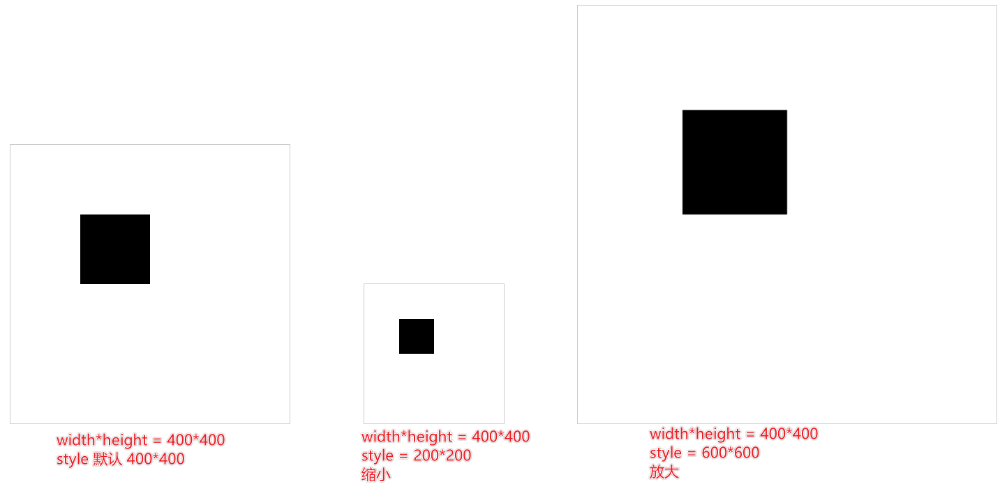

# 三 绘制图形

## 1 绘制矩形

可以绘制两种矩形， 有三种方式。

* 填充的矩形(实心矩形)
* 描边的矩形(空心矩形)

> ctx.fillRect(x , y , width ,height)

绘制填充矩形

```javascript
const ctx = canvas.getContext('2d');
ctx.fillRect(100,100,200,100);
```


> ctx.strokeRect(x , y , width , height)

绘制描边矩形

```javascript
const ctx = canvas.getContext('2d');
ctx.strokeRect(100,100,200,100);
```


> ctx.rect(x , y , width , height)

绘制矩形路径， 默认没有效果。

需要配合 ctx.stroke()  , ctx.fill() 来描边或填充才会有效果。

```javascript
const ctx = canvas.getContext('2d');
ctx.rect(100,100,200,100);
ctx.stroke();
ctx.fill();
```

> 使用ctx.fillStyle属性设置填充的颜色 （red , #f00 , rgba(255,0,0,1）
>
> 使用ctx.strokeStyle属性设置描边颜色
>
> 使用ctx.lineWidth属性设置描边粗细

* 注意：一定要在绘制图形之前设置。

```javascript
const ctx = canvas.getContext('2d');
ctx.rect(100,100,200,100);
ctx.fillStyle = 'rgba(255,0,0,0.8)'
ctx.strokeStyle = '#00f';
ctx.lineWidth = 10 ;
ctx.stroke();
ctx.fill();
//代码至此，已经绘画完毕了
//ctx.fillStyle = 'red' ; //无效果
```

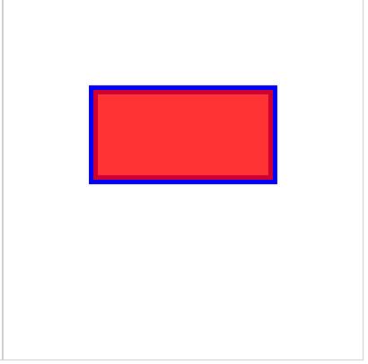

## 2 beginPath方法

stroke() 或 fill() 默认会对之前所有绘制的路径进行一个处理。

```javascript
 (()=>{
     const canvas = document.createElement('canvas');
     canvas.width = 400 ;
     canvas.height = 400 ;
     document.body.append(canvas);

     const ctx = canvas.getContext('2d');

     ctx.rect(20,20,100,100);
     ctx.stroke();

     ctx.fillStyle = '#f00';
     ctx.strokeStyle = '#0f0';
     ctx.rect(20,200,100,100);
     ctx.fill();
 })();
```

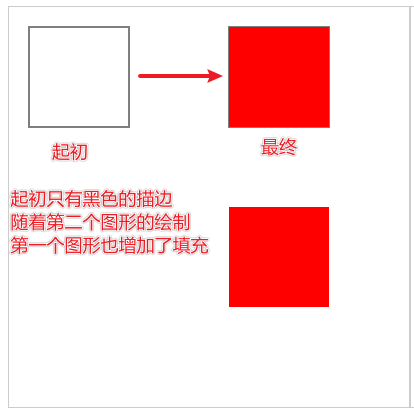

当我们需要只对刚刚绘制的图形途径进行处理时

就可以使用ctx.beginPath()方法，为不同部分的途径设置开关(设置分组)。

此时就只对紧邻这组路径进行绘制。

```javascript
(()=>{
    const canvas = document.createElement('canvas');
    canvas.width = 400 ;
    canvas.height = 400 ;
    document.body.append(canvas);

    const ctx = canvas.getContext('2d');

    ctx.beginPath();
    ctx.strokeStyle = '#00f';
    ctx.lineWidth = 10 ;
    ctx.rect(20,20,100,100);
    ctx.stroke();

    ctx.fillStyle = '#f00';
    ctx.strokeStyle = '#0f0';
    ctx.beginPath();
    ctx.rect(20,200,100,100);
    ctx.fill();
    ctx.stroke();
})();

```

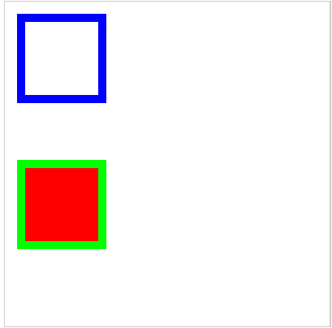

> 一组路径可以有多个图形（线，弧，曲线，矩形等）。

> 使用fillRect() , strokeRect()不会受影响。

```javascript
(()=>{
    const canvas = document.createElement('canvas');
    canvas.width = 400 ;
    canvas.height = 400 ;
    document.body.append(canvas);

    const ctx = canvas.getContext('2d');

    ctx.strokeRect(20,20,100,100);

    ctx.fillStyle = '#f00';
    ctx.fillRect(20,200,100,100);
})();
```

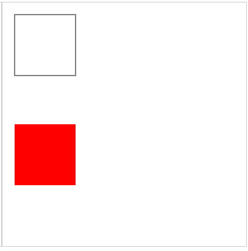

## 3 绘制圆角矩形

使用ctx.roundRect(x , y , width , height , r)方法绘制圆角矩形

```javascript
(()=>{
    const canvas = document.createElement('canvas');
    canvas.width = 400 ;
    canvas.height = 400 ;
    document.body.append(canvas);


    const ctx = canvas.getContext('2d');
    ctx.roundRect(100,100,200,200,50);
    ctx.stroke();
})();
```

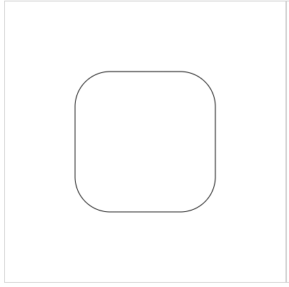

> r 有多种写法，可以实现四个圆角单独设置

r : 10 | [10]

r : [10,20] 				`[top-left-and-bottom-right, top-right-and-bottom-left]`

r : [10 ,20 ,30]		  `[top-left, top-right-and-bottom-left, bottom-right]`

r : [10 , 20 ,30 ,40]

```javascript
(()=>{
    const canvas = document.createElement('canvas');
    canvas.width = 400 ;
    canvas.height = 400 ;
    document.body.append(canvas);


    const ctx = canvas.getContext('2d');
    ctx.roundRect(10,10,100,100,[10]);
    ctx.stroke();

    ctx.roundRect(10,200,100,100,[10,30]);
    ctx.stroke();

    ctx.roundRect(200,10,100,100,[10,30,20]);
    ctx.stroke();

    ctx.roundRect(200,200,100,100,[10,20,30,40]);
    ctx.stroke();
})();
```

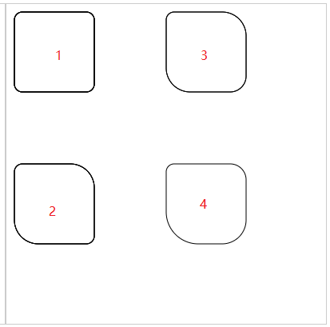

## 4 绘制直线&折线

两天之间的连线：直线

多个直线连接 : 折线

使用ctx.moveTo(x,y) 将画笔放置到指定的坐标位置 (起始点)

使用ctx.lineTo(x,y) 从上一个点绘制直线路径到指定的点。

* 上一个点可以是moveTo指定的点。
* 上一个点也可以是上一次lineTo指定的点。也就是可以多个lineTo连续使用，形成折线。

```javascript
 (()=>{
     const canvas = document.createElement('canvas');
     canvas.width = 400 ;
     canvas.height = 400 ;
     document.body.append(canvas);

     const ctx = canvas.getContext('2d');

     ctx.beginPath();
     ctx.moveTo(50,50);
     ctx.lineTo(250,50);
     ctx.stroke();

     ctx.beginPath();
     ctx.strokeStyle = '#00f';
     ctx.lineWidth = 10 ;
     ctx.moveTo(50,200);
     ctx.lineTo(250,200);
     ctx.stroke();

 })();
```

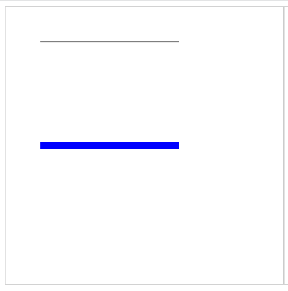

```java
(()=>{
    const canvas = document.createElement('canvas');
    canvas.width = 400 ;
    canvas.height = 400 ;
    document.body.append(canvas);

    const ctx = canvas.getContext('2d');

    ctx.moveTo(50,50);
    ctx.lineTo(200,50);
    ctx.lineTo(50,200);
    ctx.stroke();
})();
```

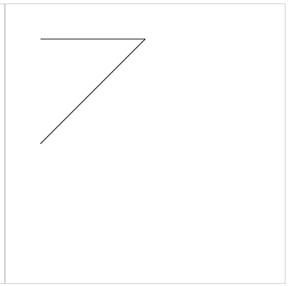

## 5 线条API

**ctx.lineWidth 属性， 设置线条粗细。**

**ctx.lineCap 属性 ， 设置线条端点的样式  （连接点， 线帽）**

* butt 平的 （默认，没有任何额外的效果）
* round 圆的 （端点处增加了半圆，视觉效果直线变长了）
* square 平的 （端点处增加了矩形，视觉效果上直线变长了）

```javascript
(()=>{
    const canvas = document.createElement('canvas');
    canvas.width = 400 ;
    canvas.height = 400 ;
    document.body.append(canvas);

    const ctx = canvas.getContext('2d');

    ctx.beginPath();
    ctx.moveTo(50,10);
    ctx.lineTo(50,90);
    ctx.moveTo(250,10);
    ctx.lineTo(250,90);
    ctx.stroke();

    ctx.lineWidth = 10 ;
    ctx.strokeStyle = '#00f';
    ctx.beginPath();
    ctx.lineCap ="butt"
    ctx.moveTo(50,30);
    ctx.lineTo(250,30);
    ctx.stroke();

    ctx.beginPath();
    ctx.lineCap ="round"
    ctx.moveTo(50,50);
    ctx.lineTo(250,50);
    ctx.stroke();

    ctx.beginPath();
    ctx.lineCap ="square"
    ctx.moveTo(50,70);
    ctx.lineTo(250,70);
    ctx.stroke();

})();

```

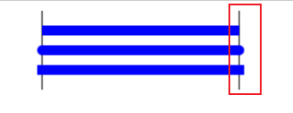

**ctx.lineJoin属性， 设置折线连接处的样式**

* miter 尖的 （默认）
* round 圆的
* bevel 平的

```javascript
(()=>{
    const canvas = document.createElement('canvas');
    canvas.width = 400 ;
    canvas.height = 400 ;
    document.body.append(canvas);

    const ctx = canvas.getContext('2d');


    ctx.lineWidth = 10 ;
    ctx.lineJoin = "miter"
    ctx.strokeStyle = '#00f';
    ctx.beginPath();
    ctx.moveTo(50,50);
    ctx.lineTo(150,150);
    ctx.lineTo(250,50);
    ctx.stroke();

    ctx.lineWidth = 10 ;
    ctx.lineJoin = "round"
    ctx.strokeStyle = '#00f';
    ctx.beginPath();
    ctx.moveTo(50,100);
    ctx.lineTo(150,200);
    ctx.lineTo(250,100);
    ctx.stroke();

    ctx.lineWidth = 10 ;
    ctx.lineJoin = "bevel"
    ctx.strokeStyle = '#00f';
    ctx.beginPath();
    ctx.moveTo(50,150);
    ctx.lineTo(150,250);
    ctx.lineTo(250,150);
    ctx.stroke();

})();
```

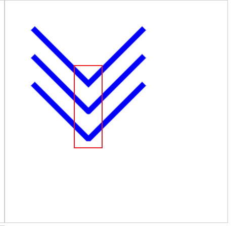

**ctx.miterLimit 属性， 限制折线形成的尖角长短。**

* 当线条比较粗， 折线夹角比较小的时候，lineJoin的miter设置形成的尖会比较长
* 可以利用该属性来控制尖角的长短

```javascript
(()=>{
    const canvas = document.createElement('canvas');
    canvas.width = 400 ;
    canvas.height = 400 ;
    document.body.append(canvas);

    const ctx = canvas.getContext('2d');

    ctx.beginPath();
    ctx.moveTo(20,100);
    ctx.lineTo(250,100);
    ctx.stroke();

    ctx.lineWidth = 30 ;
    ctx.lineJoin = "miter"
    ctx.strokeStyle = '#00f';
    ctx.beginPath();
    ctx.miterLimit = 0;
    ctx.moveTo(50,50);
    ctx.lineTo(80,100);
    ctx.lineTo(110,50);
    ctx.stroke();

    ctx.beginPath();
    ctx.miterLimit = 1;
    ctx.moveTo(150,50);
    ctx.lineTo(180,100);
    ctx.lineTo(210,50);
    ctx.stroke();

})();
```

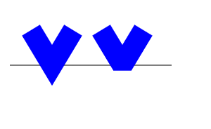

**ctx.setLineDash( array ) 方法 ，设置虚线**

array中可以放置多个数值。 分别表示线段的长度 和 线段间留白的长度。

* array = [10]  线段长度 和 留白的长度都是 10
* array = [20,10] 线段的长度(20) 和 留白的长度(10)分别设置
* array = [10,20,30]   按照数组的数列，无限的延续下去

  线段10  留白20 线段30 留白10 线段20 留白30 线段10 留白20  ....

  [10,20,30,10,20,30,10,20,30,10,20,30,.....]

```javascript
(()=>{
    const canvas = document.createElement('canvas');
    canvas.width = 400 ;
    canvas.height = 400 ;
    document.body.append(canvas);

    const ctx = canvas.getContext('2d');


    ctx.lineWidth = 10 ;
    ctx.strokeStyle = '#00f';
    ctx.beginPath();
    ctx.setLineDash([20]);
    ctx.moveTo(50,50);
    ctx.lineTo(250,50);
    ctx.stroke();

    ctx.beginPath();
    ctx.setLineDash([20,10]);
    ctx.moveTo(50,100);
    ctx.lineTo(250,100);
    ctx.stroke();

    ctx.beginPath();
    ctx.setLineDash([40,20,10]);
    ctx.moveTo(50,150);
    ctx.lineTo(250,150);
    ctx.stroke();

})();
```

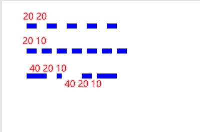

**ctx.lineDashOffset 属性 设置虚线起始位置的偏移**

* 正数值， 向左偏移
* 负数值，向右偏移

```javascript
(()=>{
    const canvas = document.createElement('canvas');
    canvas.width = 400 ;
    canvas.height = 400 ;
    document.body.append(canvas);

    const ctx = canvas.getContext('2d');

    ctx.beginPath();
    ctx.moveTo(50,10);
    ctx.lineTo(50,190);
    ctx.stroke();

    ctx.lineWidth = 10 ;
    ctx.strokeStyle = '#00f';
    ctx.beginPath();
    ctx.setLineDash([40]);
    ctx.moveTo(50,50);
    ctx.lineTo(250,50);
    ctx.stroke();

    ctx.beginPath();
    ctx.setLineDash([40]);
    ctx.lineDashOffset = -20 ;
    ctx.moveTo(50,100);
    ctx.lineTo(250,100);
    ctx.stroke();

    ctx.beginPath();
    ctx.setLineDash([40]);
    ctx.lineDashOffset = 20 ;
    ctx.moveTo(50,150);
    ctx.lineTo(250,150);
    ctx.stroke();


})();
```

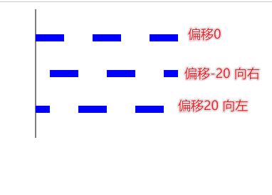

## 6 清除画布

大多数情况下，当canvas配合js动画，实现动画效果时

默认每一次都是在之前的基础上进行绘制

所以应该清除上一次的绘画效果，重新绘制。

使用ctx.clearRect( x , y , width ,height )方法，清除画布中的指定矩形区域

* 如果width 和 height 等于画布宽高，就相当于清除整个画布，否则清除画布的一部分。

> 清除画布的本质就是将指定的矩形区域，设置透明度为0，之前的路径依然存在。
>
> 绘制新路径时需要配合beginPath()，否则stroke() 或 fill() 时之前的清除效果重现。

```javascript
(()=>{
    const canvas = document.createElement('canvas');
    canvas.width = 400 ;
    canvas.height = 400 ;
    document.body.append(canvas);

    const ctx = canvas.getContext('2d');

    ctx.lineWidth = 10 ;
    ctx.moveTo(0,100);
    ctx.lineTo(400,100);
    ctx.stroke();

    ctx.clearRect(0,0,400,400);

    ctx.beginPath();
    ctx.moveTo(100,0);
    ctx.lineTo(100,400);
    ctx.stroke();

})();    
```

* 绘制横线
* 清除画布
* 绘制竖线
* 如果没有beginPath()，绘制竖线的时候，之前的横线也会出现。
* 如果有beginPath(),只会绘制竖线，之前的横线不会重新绘制。实现永久擦除效果。

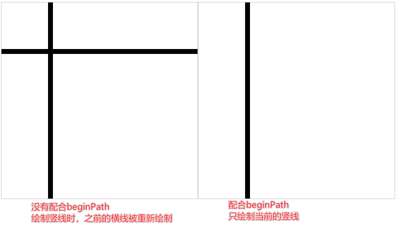

## 7 虚线小动画

<iframe src="images/01.html" height="250" /> 
## 8 closePath方法
